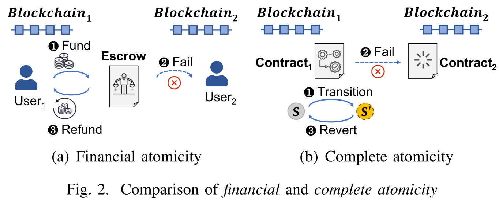

# ATOMICITY
- Keywords: Financial Atomicity, Complete Atomicity, State Machine Replication,
Cross-chain communication, Layered State Commitments

## Preliminaries

- Blockchain book, EVM basics

### State Machine Replication (SMR)

- Blockchain as we know it achieve SMR using *chained block* (surprise!). Main
features are transactions, metadata, consensus, execution. Tx in a block,
execution leads to state transitions, metadata recorded, consensus controls.

- SMR replicates state across machines (another surprise!). Byzantine generals.
2 types of replicas: honest, and the rest that arbitrary deviates.
	+ *Saftety*: An honest replica outputs `v`, and another outputs `v'` at the
	same sequence number, then `v = v'`
	+ *Liveness*: client submit  message `m`, all honest replica must follow

### Cross-chain communication (CCC)

- Deliveries of authenticated state transitions between any pair of blockchains
- `finanlity proof`: inclusion of a specific transaction in a block
- CCC properties:
	+ *Authenticity*: proof must be verifiable. If and only if `tx` is finalized
	on source chain, replica on destination chain can verify the corresponding
	state transactions (on destination chain)
	+ *Reliability*: delivery of `finanlity proof`, `tx` finalized, all relicas
	will commit the state transition of `tx`
- CCC must provide interface:
	+ *Routing*: process can submit arbitrary, finalized data on source chain to
	destination chain
	+ *Delivery* process can verify the existence and authenticity of routed data

### Atomicity

- Classical: all dependent transactions are executed or none are applied
	+ Ensure minimal financial loss
	+ May not be enough for more complex application logics that handles more than
	asset transfers (like lending!)

- Financial Atomicity: 
	+ All involved parties suffer insignificant financial loss on execution fail
	+ All parties receive execution results eventually (success, failed, timeout)

- Complete Atomicity:
	+ No state transitions triggered on abort
	+ Application success. all state transactions success, aborted otherwise
	+ All parties receive execution results eventually (success, failed, timeout)
